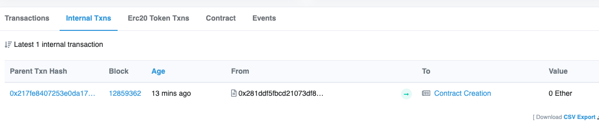

## How to create contract in contract



```bash
❯ yarn deploy
yarn run v1.22.10
warning package.json: No license field
warning ../package.json: No license field
$ hardhat run scripts/deploy.ts --network ropsten
(node:82165) ExperimentalWarning: stream/web is an experimental feature. This feature could change at any time
(Use `node --trace-warnings ...` to show where the warning was created)
No need to generate any newer typings.
(node:82195) ExperimentalWarning: stream/web is an experimental feature. This feature could change at any time
(Use `node --trace-warnings ...` to show where the warning was created)
CreateContract Tx: https://ropsten.etherscan.io/tx/0x39b9087cdd9bed78013d4a4da81f17b40a2e0c80f50368d1369002610cac6692
Deployed 🔗 Create Contract Contract Address: 0x281Ddf5FbcD21073Df817bef84A396A6c074e584
{
  hash: '0x217fe8407253e0da17c4bd38eb73f870f192b451dcd457239bcdf2b189829255',
  type: 2,
  accessList: [],
  blockHash: null,
  blockNumber: null,
  transactionIndex: null,
  confirmations: 0,
  from: '0x6E1603Fb2A0fFd3E5cEbA858e04EE47eDD82eb08',
  gasPrice: BigNumber { value: "1171000008" },
  maxPriorityFeePerGas: BigNumber { value: "1171000000" },
  maxFeePerGas: BigNumber { value: "1171000008" },
  gasLimit: BigNumber { value: "320218" },
  to: '0x281Ddf5FbcD21073Df817bef84A396A6c074e584',
  value: BigNumber { value: "0" },
  nonce: 66,
  data: '0xa0815de3',
  r: '0x1b1700c0d359ee7fe33d4fcb15ba2d2e8ebeb7b3d6629b0e4deccd423bdd5a59',
  s: '0x0b3dd04873b0efc4c2d5b345a2013db1a0a36dcfebe2b990e3380ac0cf289aa5',
  v: 0,
  creates: null,
  chainId: 3,
  wait: [Function (anonymous)]
}
exec 🏄🏻‍♂️ 'createGreeterContract' Tx: https://ropsten.etherscan.io/tx/0x217fe8407253e0da17c4bd38eb73f870f192b451dcd457239bcdf2b189829255
0xa0815de3
✨  Done in 52.19s.
```

get greet

```bash
❯ yarn greet
yarn run v1.22.10
warning package.json: No license field
warning ../package.json: No license field
$ hardhat run scripts/check.ts --network ropsten
(node:85304) ExperimentalWarning: stream/web is an experimental feature. This feature could change at any time
(Use `node --trace-warnings ...` to show where the warning was created)
(node:85307) ExperimentalWarning: stream/web is an experimental feature. This feature could change at any time
(Use `node --trace-warnings ...` to show where the warning was created)
greet is used create2 contract
✨  Done in 5.09s.
```
